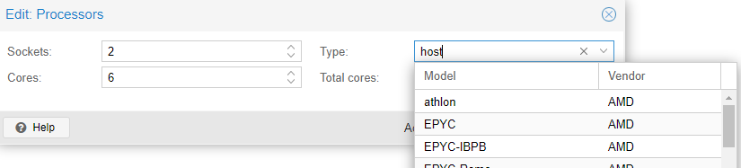

This repo is a fork of the Berkeley AUTOLAB's dex-net GQ-CNN. For their documentation and code see:
<https://berkeleyautomation.github.io/dex-net/>

<https://berkeleyautomation.github.io/gqcnn/>

<https://github.com/BerkeleyAutomation/gqcnn>

## Prerequisites

### Python

The gqcnn package has only been tested with Python 3.5, Python 3.6, and Python 3.7.

### Ubuntu

The gqcnn package has only been tested with Ubuntu 12.04, Ubuntu 14.04 and Ubuntu 16.04.

### Virtualenv

We highly recommend using a Python environment management system, in particular Virtualenv, with the Pip and ROS installations. Note: Several users have encountered problems with dependencies when using Conda.

## Pip Installation

The pip installation is intended for users who are only interested in 1) Training GQ-CNNs or 2) Grasp planning on saved RGBD images, not interfacing with a physical robot. If you have intentions of using GQ-CNNs for grasp planning on a physical robot, we suggest you install as a ROS package.

##### Troubleshooting

If using a VM, ensure that Processor type is set to 'host' in the Proxmox VM settings. This enables CPU accelerators that are required for tensorflow versions > 1.5 (see <https://forum.proxmox.com/threads/avx2-and-avx-flags-on-vm.87808/>)

### 1. Clone the repository

Clone or download the project from Github.

    git clone <git@code.siemens.com:FMP_Analytics/edgeapps-for-shop4cf/dex-net.git>

### 2. Run pip installation

Change directories into the gqcnn repository and run the pip installation.

    pip install .

This will install gqcnn in your current virtual environment.

## Inference

WIth the virtualenv activated, run from the gqcnn directory:

    python fmp-tools/policy_custom.py GQCNN-2.0 --depth_image fmp-tools/0004_depth.npy --segmask fmp-tools/Segmask_simple.png --camera_intr data/calib/realsense/realsense.intr --config_filename cfg/examples/replication/dex-net_2.0.yaml

Alternatively there is a launch.json that can be used to run the model in vscode on custom images. Make sure to specify the right python interpreter of the virtualenv.

Note that --segmask and --config_filename are optional parameters.

## Generate training masks with color background subtractions

To generate optional segmentation masks by subtracting a pink background, run

    python fmp-tools/background_subtraction.py --png_image <image path>

To convert a .png image to the .npy format that gq-cnn requires, run png_to_npy_converter.py

    python fmp-tools/png_to_npy_converter.py --png_image <image path>

## Reference

@article{mahler2019learning,
  title={Learning ambidextrous robot grasping policies},
  author={Mahler, Jeffrey and Matl, Matthew and Satish, Vishal and Danielczuk, Michael and DeRose, Bill and McKinley, Stephen and Goldberg, Ken},
  journal={Science Robotics},
  volume={4},
  number={26},
  pages={eaau4984},
  year={2019},
  publisher={AAAS}
}
